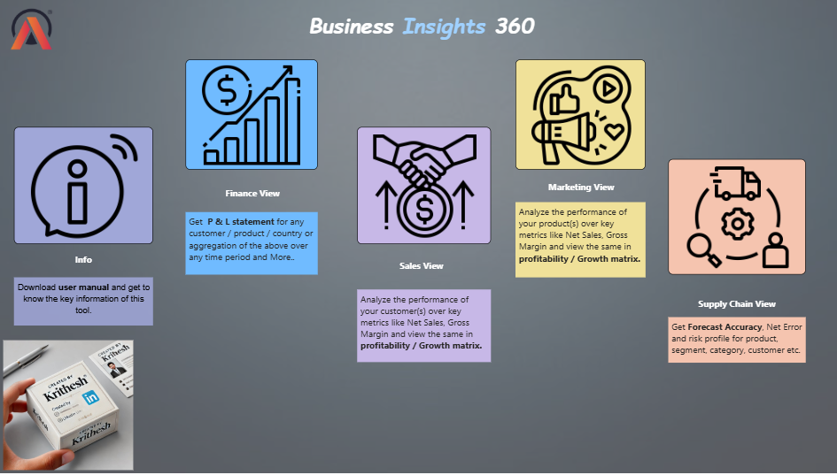

# 📊 Business Insights 360 – Power BI Project

---

## 📌 Overview
**Business Insights 360** is an end-to-end **Power BI dashboard** designed for **AtliQ Hardware**.  
It delivers actionable insights across **Finance, Sales, Marketing, Supply Chain, and Executive Management** — helping leaders make data-driven decisions faster.  

---
## 🖼️ Dashboard Preview

  

---

## 🚀 Features
- 💰 **Finance View** → Revenue, expenses & profit margin trends  
- 📈 **Sales View** → Product & customer performance insights  
- 🎯 **Marketing View** → Campaign effectiveness & ROI tracking  
- 🚚 **Supply Chain View** → Forecast accuracy & risk profiling  
- 🏢 **Executive View** → High-level KPIs for decision-makers  

---

## 🌍 Live Dashboard
👉 [Click here to explore the live dashboard](https://app.powerbi.com/view?r=eyJrIjoiZjNmODU5MWEtZDk0ZC00MDE1LWJiNDgtNzBmMmI5YTkzZTJjIiwidCI6ImM2ZTU0OWIzLTVmNDUtNDAzMi1hYWU5LWQ0MjQ0ZGM1YjJjNCJ9)

---

## 🏆 Key Highlights
- 🔗 **Integrated Data** → Combined Excel/CSV with MySQL sources  
- 🎨 **Custom Visuals** → Tailored dashboards for Finance, Sales, Marketing & SCM  
- ⚡ **Performance Optimized** → Reduced report load time, boosting efficiency by **5%**  
- 📊 **Business Impact** → Enabled AtliQ Hardware to track KPIs, cut costs, and improve forecasting accuracy  

---

## ⚙️ Getting Started
1. Clone this repository  
2. Open the `.pbix` file in **Power BI Desktop**  
3. Explore dashboards, DAX queries, and data models  

---

## 📂 Data Sources
- **Excel/CSV** → Targets, Market Share, and ad-hoc inputs  
- **MySQL Database** → Fact tables & Dimension tables  

---

## 🛠️ Prerequisites
- [Power BI Desktop](https://powerbi.microsoft.com/desktop/)  
- [DAX Studio](https://daxstudio.org/)  

---

## 🤝 Contributing
Contributions are welcome! Please **open issues** or **submit pull requests**.  

---

## 📝 License
Licensed under the **MIT License** – see the [LICENSE](LICENSE) file for details.  
